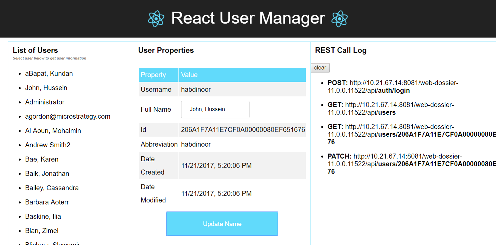

# React User Manager
This sample project demonstrates how REST API calls work with ReactJS and showcases a React component that can be used to display a log of all REST API calls.

This project was bootstrapped with [Create React App](https://github.com/facebook/create-react-app).



## Understanding the API workflow
This React project authenticates a user, retrieves and displays a list of users linked to a specific REST server, and allows the authenticated user to view and edit data for a user selected from the list. It also displays a log of all REST API calls that are made while the project is in use.

  #### 1. POST /auth/login

  This REST API authenticates a user. It creates a MicroStrategy session using credentials for the user and a specified authorization mode. It returns an authToken, which will be used by subsequent REST API calls. I

  #### 2. GET /users/

  This REST API returns a list of users belonging to the Intelligence Server that is used by the project.

  #### 3. GET /users/{userId}

  This REST API returns a single user, from the list of users, based on the user ID.

  #### 4. PATCH /users/{userId}

  This REST API makes a partial change to a single user, from the list of users, based on the user ID.

## Folders and Files in this project

This project contains the following folders and files:

   - **src**
      - This folder contains all the javascript code for the sample, as well as CSS and image files (.png and .svg).

   - **package.json**/**package-lock.json**
      - This is the node.js configuration/dependency file.

   - **public**
      - This is the default public folder that is generated when a React app is created.

## Setting up the sample
To set up the sample:

#### 1. Install node.js if you have not already done so.

#### 2. Install project dependencies.

   - Open a Command Prompt window in Windows or a Terminal in Mac.
   
   - Install the required node modules
   
   - Navigate to the project location and run npm install.

Leave the Command Prompt window or Terminal open. After you have configured the sample, you will use this window to start the app.

#### 3. If you plan to use the samples on a Web page that is on a different domain from your MicroStrategy environment, please make sure your enable Cross-Origin Resource Sharing (CORS) in MicroStrategy Library.

#### 4. Navigate to the sample and open store.js. It includes the following code:

```javascript
...
  const DEFAULT_USERNAME = 'enter your user name';

  const DEFAULT_PASSWORD = 'enter your password';

  const DEFAULT_REST_SERVER = 'http://your MicroStrategy Library server name and port/consume-dev/api/';

  const initState = {users: null, username: DEFAULT_USERNAME, password: DEFAULT_PASSWORD, url: DEFAULT_REST_SERVER, loginToken: null};

  const store = createStore(reducer, initState, window.__REDUX_DEVTOOLS_EXTENSION__ && window.__REDUX_DEVTOOLS_EXTENSION__());
...
```
#### 5. Make the following changes:

- Enter the **username** you want to log in with as the value of the `DEFAULT_USERNAME` constant.
- Enter the **password** you want to log in with as the value of the `DEFAULT_PASSWORD` constant.
- Enter the **name** and **port** for your MicroStrategy Library installation in the path for the `DEFAULT_REST_SERVER` constant.

#### 6.Save your changes.

## Using the sample

#### 1. In a Command Prompt window in Windows or terminal in Mac, run `npm start` from inside the sample project folder.

#### 2. The React User Manager app opens in your browser ( http://localhost:3000), covered by a login page.

   - On the left of the app is a section for a List of Users, where users that belong to the Intelligence Server linked to the project will be displayed
   - In the middle is a section where User Properties for a user selected from the list will be displayed. This information can be edited and saved.
   - On the right is the REST Call Logsection where REST API calls will be listed as they are made, beginning with authentication.
#### 3. Confirm that the user name and password on the login page are correct and click the log in button.
The app pulls the list of users from the Intelligence Server and displays them under List of Users on the left.

#### 4. Under User Properties, click on a specific user to display properties for that user.
 You can change the name in the text box. When you press Enter, the user properties are updated.

#### 5. Beginning with authentication, the REST API call for each action that is performed is logged on the right under REST Call Log.


## Available Scripts

In the project directory, you can run:

### `yarn start`

Runs the app in the development mode.\
Open [http://localhost:3000](http://localhost:3000) to view it in the browser.

The page will reload if you make edits.\
You will also see any lint errors in the console.

### `yarn test`

Launches the test runner in the interactive watch mode.\
See the section about [running tests](https://facebook.github.io/create-react-app/docs/running-tests) for more information.

### `yarn build`

Builds the app for production to the `build` folder.\
It correctly bundles React in production mode and optimizes the build for the best performance.

The build is minified and the filenames include the hashes.\
Your app is ready to be deployed!

See the section about [deployment](https://facebook.github.io/create-react-app/docs/deployment) for more information.

### `yarn eject`

**Note: this is a one-way operation. Once you `eject`, you can’t go back!**

If you aren’t satisfied with the build tool and configuration choices, you can `eject` at any time. This command will remove the single build dependency from your project.

Instead, it will copy all the configuration files and the transitive dependencies (webpack, Babel, ESLint, etc) right into your project so you have full control over them. All of the commands except `eject` will still work, but they will point to the copied scripts so you can tweak them. At this point you’re on your own.

You don’t have to ever use `eject`. The curated feature set is suitable for small and middle deployments, and you shouldn’t feel obligated to use this feature. However we understand that this tool wouldn’t be useful if you couldn’t customize it when you are ready for it.

## Learn More

You can learn more in the [Create React App documentation](https://facebook.github.io/create-react-app/docs/getting-started).

To learn React, check out the [React documentation](https://reactjs.org/).

### Code Splitting

This section has moved here: [https://facebook.github.io/create-react-app/docs/code-splitting](https://facebook.github.io/create-react-app/docs/code-splitting)

### Analyzing the Bundle Size

This section has moved here: [https://facebook.github.io/create-react-app/docs/analyzing-the-bundle-size](https://facebook.github.io/create-react-app/docs/analyzing-the-bundle-size)

### Making a Progressive Web App

This section has moved here: [https://facebook.github.io/create-react-app/docs/making-a-progressive-web-app](https://facebook.github.io/create-react-app/docs/making-a-progressive-web-app)

### Advanced Configuration

This section has moved here: [https://facebook.github.io/create-react-app/docs/advanced-configuration](https://facebook.github.io/create-react-app/docs/advanced-configuration)

### Deployment

This section has moved here: [https://facebook.github.io/create-react-app/docs/deployment](https://facebook.github.io/create-react-app/docs/deployment)

### `yarn build` fails to minify

This section has moved here: [https://facebook.github.io/create-react-app/docs/troubleshooting#npm-run-build-fails-to-minify](https://facebook.github.io/create-react-app/docs/troubleshooting#npm-run-build-fails-to-minify)